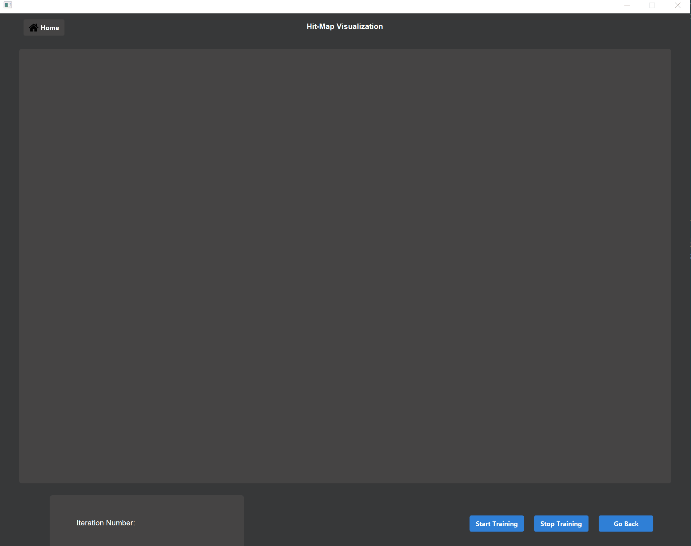

# Kohonen - Self Organizing Maps

## Introduction
Final year project to develop a visualization and learning tool based on Self-Organizing Maps.

###### Libraries used and required to compile and run
* JFoenix 
* AnimateFx 
* FXGraphics 2D
* Scalr   
* JLatex

  
# Visualization Screenshots

##  Hit-Map Visualization

  
##  Training Visualization

  
# Learning Tool Screenshots

##  Algorithm Simulation

##  Multiple Choice Questionnaire

##  Walkthrough

  
# Contributors
* **Farhan Tariq**

  
# LICENSE

